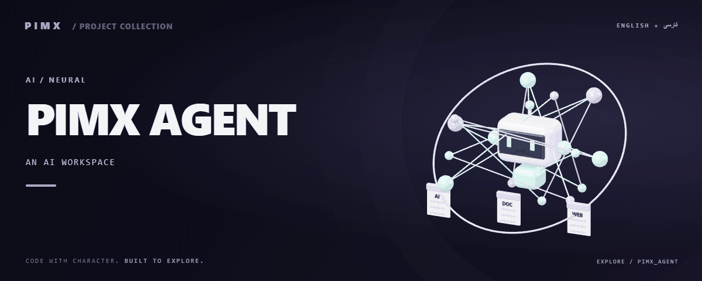

<div align="center">



**[English](README.md) · [فارسی](README.fa.md)**

</div>

# 🧠 PIMX AGENT

<!-- pimx-live-site:start -->
## Live website

**[Open PIMX_AGENT ↗](https://pimxagent.pages.dev/)**

[Alternate Cloudflare Workers website ↗](https://pimxagent.mohammadrezaabedinpoor6.workers.dev/)
<!-- pimx-live-site:end -->

A Next.js AI workspace with provider configuration, conversations, attachments, project/library organization, research tools and document/presentation workflows.

[GitHub](https://github.com/MOHAMMADREZAABEDINPOOR/PIMX_AGENT) · [PIMX / Profile](https://github.com/MOHAMMADREZAABEDINPOOR) · [Static artwork](assets/readme/hero.png)

| At a glance | Details |
|:---|:---|
| 🧠 Experience | Web application / browser experience |
| 🧰 Built with | `React` · `Next.js` · `TypeScript` · `Three.js` |
| 🌐 Documentation | [English](README.md) · [فارسی](README.fa.md) |

[✨ Features](#features) · [🚀 Getting started](#getting-started) · [⚙️ Configuration](#configuration) · [🌍 Deployment](#deployment)

📖 [Detailed project guide](docs/PROJECT_GUIDE.md)

---

<a id="features"></a>

## ✨ Features

| Area | Included capability |
|:---|:---|
| 🧠 Intelligence | Provider selection, comparison and configurable credentials |
| ⚡ Workflow | Chat, attachments, source Q&A and retrieval helpers |
| 🧠 Intelligence | Canvas, research, slides and export tools |
| 👤 Accounts | Account/workspace controls and Cloudflare adapters |

<a id="stack"></a>

## 🧰 Stack

| Tool | Version / source |
|---|---|
| React | `^19.2.1` |
| Next.js | `^16.3.4` |
| TypeScript | `5.9.3` |
| Three.js | `^0.186.1` |
| Motion | `^12.23.24` |
| Tailwind CSS | `4.1.11` |

<a id="getting-started"></a>

## 🚀 Getting started

Node.js 22.12+ and the package manager declared in package.json. Install dependencies from the checked-in lockfile where available.

```bash
git clone https://github.com/MOHAMMADREZAABEDINPOOR/PIMX_AGENT.git
cd PIMX_AGENT

npm ci
npm run dev
```

<a id="configuration"></a>

## ⚙️ Configuration

These names are found in the example configuration or source; not all are required. Check their defaults/usage in those files and supply secrets only in your local or hosting environment.

| Name | Role |
|---|---|
| `ALLOW_LOCAL_PROVIDERS` | Application setting; inspect its definition |
| `ALLOW_SHARED_PROVIDER_KEYS` | Credential/connection setting; keep private |
| `APP_DATA_DIR` | Application setting; inspect its definition |
| `APP_DATA_ENCRYPTION_KEY` | Credential/connection setting; keep private |
| `APP_PROXY_SECRET` | Credential/connection setting; keep private |
| `APP_RUNTIME` | Application setting; inspect its definition |
| `APP_SURFACE` | Application setting; inspect its definition |
| `APP_URL` | Application setting; inspect its definition |
| `GEMINI_API_KEY` | Credential/connection setting; keep private |
| `NEXT_PUBLIC_TURNSTILE_SITE_KEY` | Public browser configuration; never put secrets here |
| `TEST_BASE_URL` | Application setting; inspect its definition |
| `TRUST_PROXY` | Application setting; inspect its definition |
| `TURNSTILE_SECRET_KEY` | Credential/connection setting; keep private |

Hosting bindings: `ASSETS`, `DB`.

<a id="usage"></a>

## 🎯 Usage

Configure `.env` from `.env.example`, start the application and choose an AI provider in settings. Add credentials for that provider, then open a chat, attach a document or create a project.

<a id="project-structure"></a>

## 🗂️ Project structure

| Path | Role |
|---|---|
| [`app/`](app/) | Application routes / PHP application |
| [`assets/`](assets/) | Brand/media/README assets |
| [`components/`](components/) | Reusable interface components |
| [`docs/`](docs/) | Supporting documentation |
| [`lib/`](lib/) | Shared application modules |
| [`migrations/`](migrations/) | Database migrations |
| [`public/`](public/) | Public web assets |
| [`scripts/`](scripts/) | Development and maintenance utilities |
| [`tests/`](tests/) | Existing automated checks |
| [`metadata.json`](metadata.json) | Project entry/configuration file |
| [`package.json`](package.json) | Project entry/configuration file |
| [`tsconfig.json`](tsconfig.json) | Project entry/configuration file |

<a id="commands-and-checks"></a>

## 🧪 Commands and checks

| Command | Purpose |
|:---|:---|
| `npm run dev` | 🧑‍💻 Development server |
| `npm run build` | 📦 Production build |
| `npm run start` | ▶️ Application server |
| `npm run build:cloudflare` | 🔧 build:cloudflare |
| `npm run pages:build` | 🔧 pages:build |
| `npm run lint` | 🧹 Lint source |
| `npm run test` | 🧪 Declared tests |
| `npm run check` | 🔎 Source checks |

```bash
npm run dev
npm run build
npm run start
npm run build:cloudflare
npm run pages:build
npm run lint
npm run test
npm run check
npm run security:secrets
```

These commands are declared in package.json; the list is not a test execution report. Test commands may need a browser, service or prepared database.

<a id="deployment"></a>

## 🌍 Deployment

Use build/start for Node hosting, or the Cloudflare-specific package.json scripts with your own bindings. Configure databases/secrets separately and consult the repository’s supporting guides.

<a id="limitations"></a>

## 📌 Limitations

Provider availability, pricing and limits vary. Database and Cloudflare bindings must match the chosen deployment. Model names in the catalog are configuration entries, not a guarantee of provider availability.

<a id="troubleshooting"></a>

## 🛠️ Troubleshooting

- Missing packages: install dependencies using the project’s package manager.
- API/network failure: check the configured origin, provider and hosting bindings.
- Old assets: rebuild when a build script exists, then clear the browser cache.

<a id="contributing"></a>

## 🤝 Contributing

Create a focused branch, verify the affected behavior and explain the change clearly. Keep private data, build outputs and local databases out of commits.

<a id="license"></a>

## 📄 License

No repository-level license file is included in this snapshot. Public visibility alone does not grant reuse rights; contact the repository owner for terms.

---

Part of **PIMX** · Documentation in English and Persian.

---

<div align="center">

🧠 **PIMX AGENT** · [English](README.md) · [فارسی](README.fa.md)

</div>
